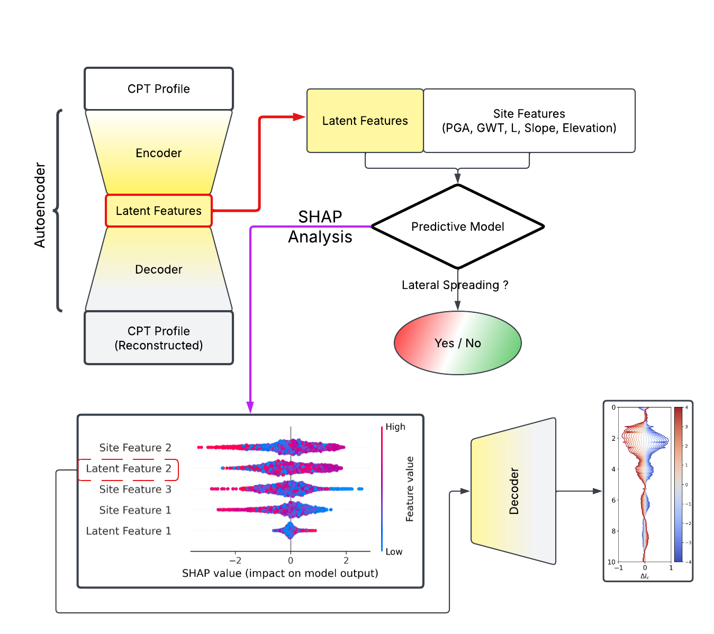
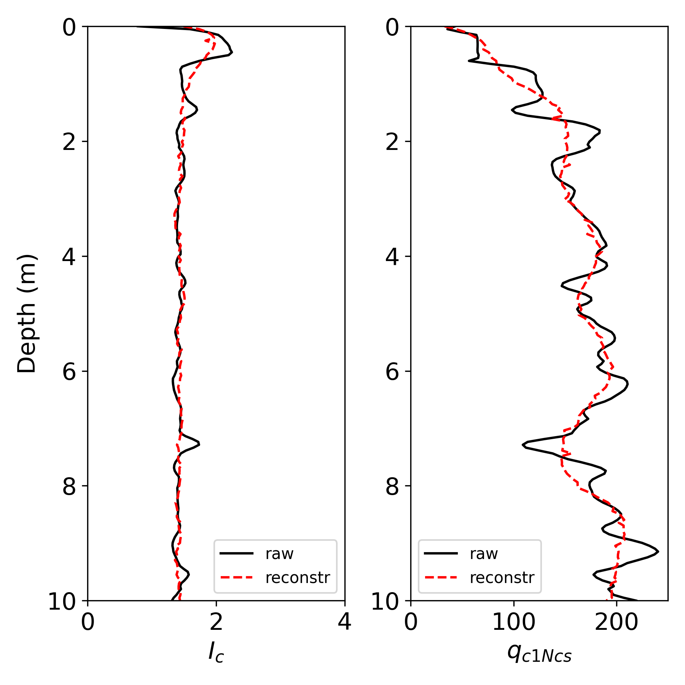
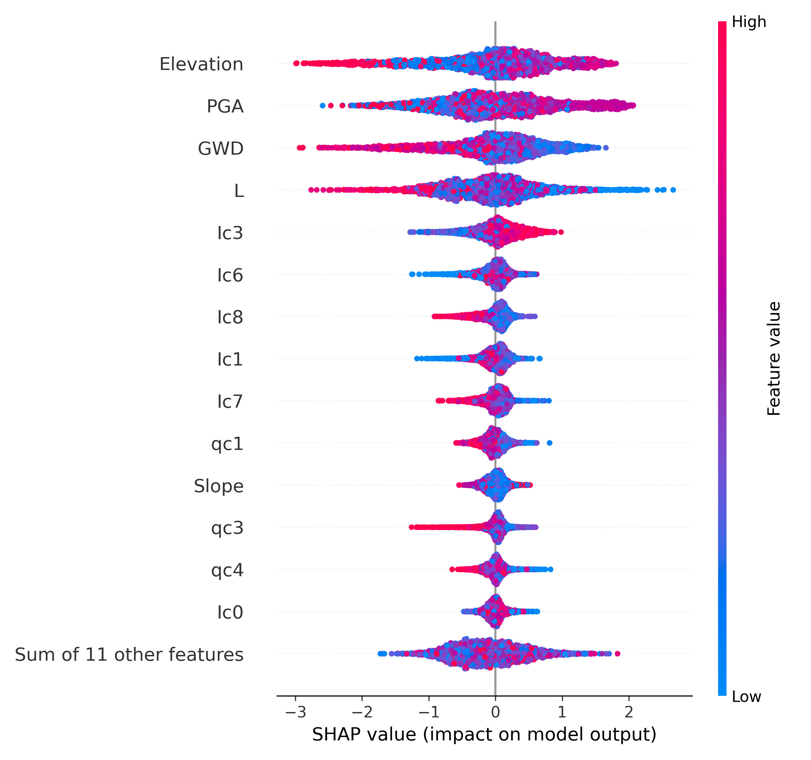
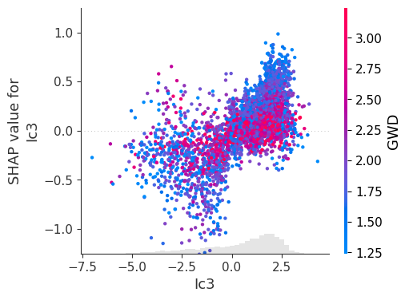
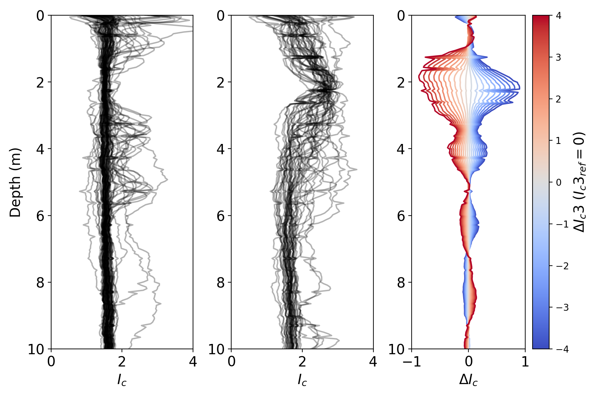

# Introduction

Lateral spreading is a severe consequence of earthquake-induced liquefaction. Researchers have used machine learning (ML) to improve predictions, often relying on predefined “critical layers” based on engineering judgment. However, this assumption may oversimplify soil profile complexities. Recent studies attempted to extract CPT-based features, such as median and standard deviation, but found them inadequate for improving ML model accuracy. To address this, we propose a data-driven feature extraction method using an autoencoder to capture nonlinear relationships. The extracted latent features will serve as input for an XGBoost model to predict lateral spreading. We will analyze feature importance using SHapley Additive exPlanations (SHAP) and visualize the encoded CPT representations through a sampling approach. By eliminating subjective engineering judgment, this study aims to enhance ML-based liquefaction assessment, providing a more robust and interpretable framework for predicting lateral spreading.

# Methods
The framework consists of four parts:

1. Training an autoencoder to compress CPT profiles into latent features.
2. Training a predictive model using site features (such as PGA) along with the latent features from the autoencoder to predict lateral spreading occurrence.
3. Using SHAP explanations to identify the most important latent feature.
4. Using the decoder to determine which part of the CPT profile affects the prediction the most.

    

# Results
## Autoencoder Training for CPT Profiles

The reconstruction results show that the autoencoder effectively captures the trend of the CPT profile and compresses it into a lower-dimensional representation. The compressed latent features are then concatenated with site features (PGA, GWD, Elevation, L [distance to the river], and slope) to train an XGB model. 

    

## XGB Models for Lateral Spreading Prediction

To evaluate the impact of latent features on prediction performance, we train four models using different combinations of input features. The results indicate that incorporating CPT latent features as inputs enhances model performance.

| Model | Input Features | Accuracy | Precision | Recall | F1-Score |
|-------|----------------|----------|-----------|--------|----------|
| Model 1 | Site Features Only | 0.79 | 0.77 | 0.78 | 0.78 |
| Model 2 | Site Features + CPTmed & std | 0.82 | 0.79 | 0.81 | 0.80 |
| Model 3 | Site Features + CPT1-m avg  | 0.80 | 0.81 | 0.75 | 0.78 |
| Model 4 | Site Features + CPTlatent  | 0.83 | 0.85 | 0.77 | 0.81 |

## SHAP Analysis
- We employ SHAP analysis to interpret our model. The analysis reveals that the most important site features are Elevation, PGA, GWD, and L, while the most influential latent feature is Ic3, a latent feature derived from the Ic profile.
- The SHAP analysis indicates that a high Ic3 value is associated with high SHAP values, suggesting that sites with high Ic3 are more likely to experience lateral spreading.
- The SHAP values of Ic3 are significantly influenced by GWD—the deeper the GWD, the lower the Ic3 SHAP values.

    
    

## Decoding Latent Feature
- To further investigate this relationship, we sample the latent features, decode them into reconstructed profiles, and observe that Ic3 has a significant impact on the Ic profile at depths of 1–3 meters. The reconstructed profiles show that sites with high Ic3 values tend to have low Ic values (sandy soils), while sites with low Ic3 values exhibit high Ic values (clayey soils) within this depth range.
- This observation aligns with the SHAP analysis and our understanding of liquefaction. Additionally, the emphasis on the 1–3 meters depth explains why Ic3 becomes less important when GWD is deeper.

    

